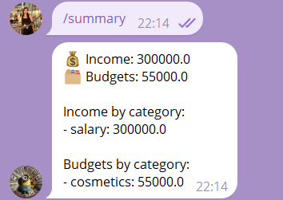

# Telegram Bot by Abdrakhmanova Aigerim and Bizhumanova Dariga

A simple Telegram bot that helps users track income, budgets, and view summaries using natural text commands. Built using `pyTelegramBotAPI`.

---

## 📦 Features

- Configure income & budgets by category  
- Log income and expenses with a simple format  
- View balance summaries and breakdowns  
- Enable/disable notifications  
- All data stored locally in `data.json`

---

## 🔧 Commands

| Command       | Description                                 |
|---------------|---------------------------------------------|
| `/start`      | Welcome message                             |
| `/help`       | Show available commands                     |
| `/log`        | Instructions for logging income or budget   |
| `/summary`    | View total and per-category summary         |
| `/config`     | View your configured categories             |
| `/notifyon`   | Enable notifications                        |
| `/notifyoff`  | Disable notifications                       |

---

## 📝 Logging Format

Use the following format to log data:

income category amount
budget category amount

**Example**:
income salary 150000
budget groceries 50000

---

## 🖼 Screenshots

> Add your Telegram screenshots here to show the bot in action. Example:

  

---

## 🚀 Getting Started

1. Clone the repo or copy the files
2. Install requirements:

pip install pyTelegramBotAPI

3. Replace `API_TOKEN` with your own Telegram Bot Token
4. Run the bot:

---

## 📂 Files

- `bot.py` — main logic of the bot  
- `data.json` — storage of all user inputs  
- `README.md` — instructions and info

---

## 🛠 Tech Stack

- Python 3
- Telebot (pyTelegramBotAPI)
- JSON (for storage)

---

